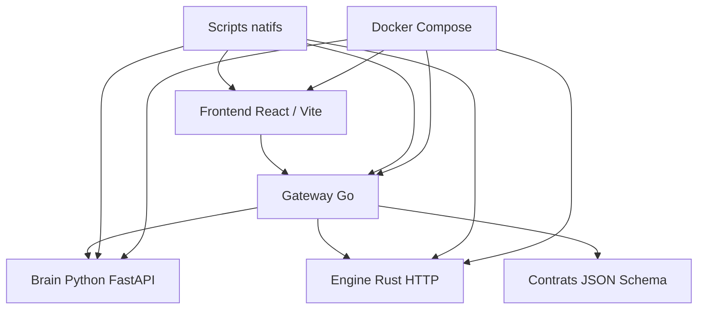
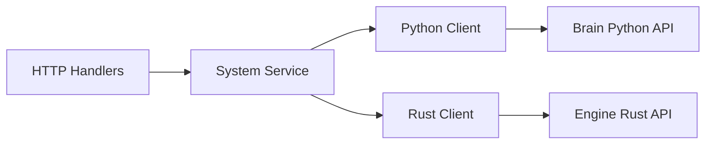
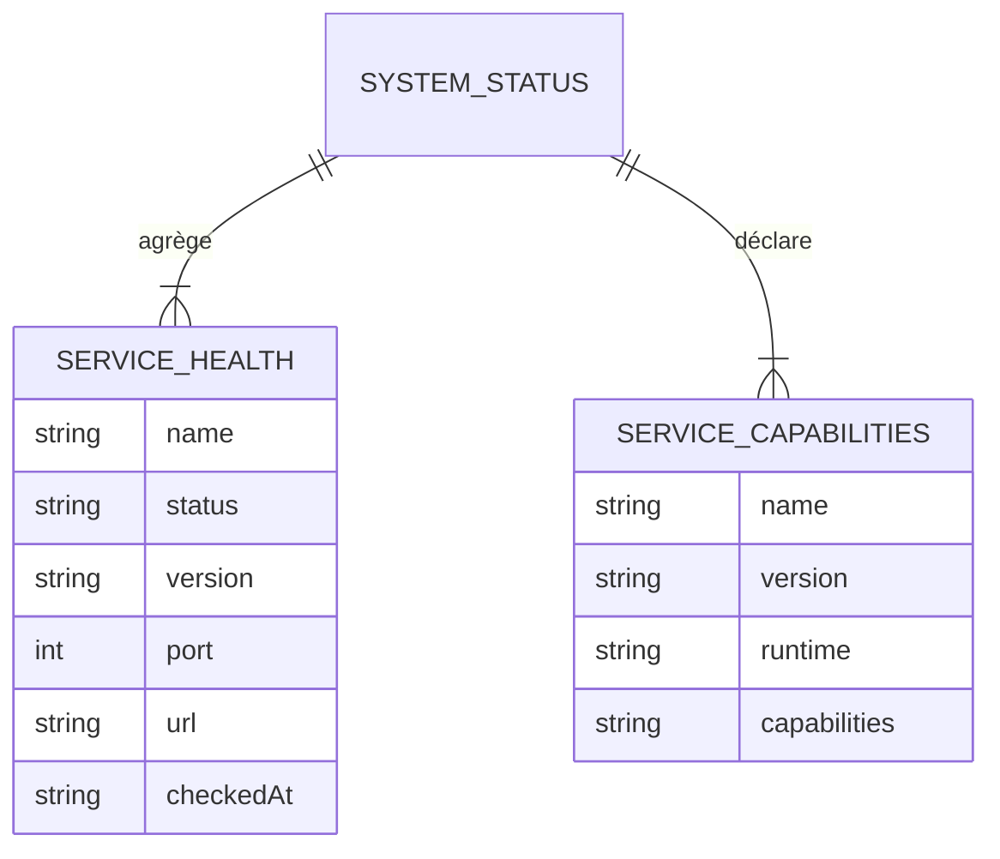

## 1. Conception De L'Architecture



## 2. Description Technologique
- Frontend : React 18 + TypeScript + Vite
- Gateway : Go 1.22+ avec serveur HTTP standard
- Brain : Python 3.11 + FastAPI + Uvicorn
- Engine : Rust stable + Axum + Tokio
- Contrats : JSON Schema partagés dans `contracts/`
- Orchestration : scripts natifs + `docker-compose`

## 3. Définition Des Routes
| Route | Objectif |
|-------|----------|
| `/` | Dashboard de fondation côté frontend |
| `/health` | Vérifier la santé d'un service |
| `/api/v1/system/status` | Retourner l'état agrégé du système |
| `/api/v1/system/services` | Retourner les services connus et leurs métadonnées |
| `/internal/capabilities` | Retourner les capacités déclarées du `brain_python` |
| `/capabilities` | Retourner les capacités déclarées du `engine_rust` |

## 4. Définitions D'API

```ts
export type ServiceHealth = {
  name: string
  status: "healthy" | "degraded" | "offline"
  version: string
  port: number
  url: string
  checkedAt: string
  details?: string
}

export type ServiceCapabilities = {
  name: string
  version: string
  runtime: "go" | "python" | "rust" | "web"
  capabilities: string[]
}

export type SystemStatus = {
  product: "aNtaerus"
  phase: "foundation"
  environment: string
  services: ServiceHealth[]
  capabilities: ServiceCapabilities[]
}
```

### Endpoints Go
- `GET /health`
  - réponse : état du gateway
- `GET /api/v1/system/services`
  - réponse : liste des services connus avec statut
- `GET /api/v1/system/status`
  - réponse : agrégation complète pour le frontend

### Endpoints Python
- `GET /health`
  - réponse : état du service Python
- `GET /internal/capabilities`
  - réponse : capacités déclarées du brain minimal

### Endpoints Rust
- `GET /health`
  - réponse : état du moteur Rust
- `GET /capabilities`
  - réponse : capacités réservées du moteur

## 5. Diagramme D'Architecture Serveur



## 6. Modèle De Données

### 6.1 Définition Logique
Cette phase n'introduit pas encore de base métier persistante. Les données manipulées sont des objets de supervision :
- santé de service
- métadonnées système
- capacités déclarées



### 6.2 Règles D'Implémentation
- configuration immuable dans chaque service
- aucune mutation d'environnement à runtime
- tous les échanges inter-services de cette phase passent par HTTP JSON
- les schémas JSON partagés servent de source de vérité légère avant l'introduction future de Protobuf/gRPC
- la structure du monorepo doit rester compatible avec une future extension vers :
  - WebSocket métier
  - gRPC Go ↔ Rust
  - mémoire SQLite
  - auth et configuration avancée
