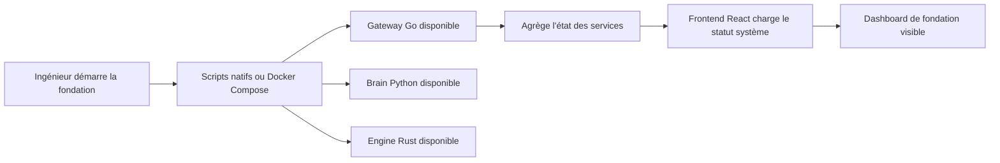

## 1. Vue D'Ensemble Du Produit
`aNtaerus` phase fondation est une première livraison d'ingénierie qui transforme le cahier des charges en monorepo polyglotte exécutable. Cette version ne vise pas encore l'assistant complet, mais un socle fiable, testable et extensible.

- Problème adressé : absence actuelle d'ossature projet pour supporter la vision `Go/Rust/Python/React`
- Valeur visée : accélérer les futures phases produit grâce à des services démarrables, des contrats explicites et une orchestration standardisée

## 2. Fonctionnalités Coeur

### 2.1 Rôles Utilisateurs
| Rôle | Méthode d'accès | Permissions coeur |
|------|------------------|-------------------|
| Ingénieur plateforme | Exécution locale | Démarrer les services, vérifier leur état, faire évoluer l'architecture |
| Développeur frontend | Navigateur local | Consulter l'état agrégé du système via le dashboard |
| Développeur backend | API locale | Interroger les endpoints de healthcheck et de capacités |

### 2.2 Modules Fonctionnels
1. **Dashboard de fondation** : interface React locale affichant l'état système et les services disponibles
2. **Gateway système** : API Go exposant healthchecks et agrégation de statut
3. **Brain minimal** : service Python déclarant son état et ses capacités internes
4. **Engine minimal** : service Rust déclarant son état et ses capacités réservées
5. **Orchestration développeur** : scripts natifs et `docker-compose` pour démarrage local

### 2.3 Détail Des Pages
| Nom de page | Module | Description fonctionnelle |
|-------------|--------|----------------------------|
| Dashboard de fondation | En-tête système | Présente le nom `aNtaerus`, l'objectif de la phase et les métadonnées d'environnement |
| Dashboard de fondation | Vue services | Affiche l'état de `gateway_go`, `brain_python`, `engine_rust` et du frontend |
| Dashboard de fondation | Contrats et endpoints | Liste les routes exposées et les capacités déclarées |
| Dashboard de fondation | Santé globale | Présente l'état agrégé retourné par le gateway |

## 3. Processus Coeur
Flux principal :
- l'ingénieur démarre les services via scripts natifs ou `docker-compose`
- le `gateway_go` contacte les services Python et Rust
- le frontend interroge le gateway pour obtenir l'état global
- le dashboard affiche les services disponibles et les endpoints actifs

## 4. Conception De L'Interface

### 4.1 Style Visuel
- Couleurs : base sombre `slate/zinc`, accent principal cyan, accent secondaire ambre
- Boutons : larges, anguleux, avec halo discret et contraste fort
- Typographie : style technique et éditorial, hiérarchie courte et lisible
- Mise en page : desktop-first, cartes de supervision et panneaux d'état
- Icônes : `lucide-react`, imagerie sobre orientée observabilité

### 4.2 Vue Des Modules
| Nom de page | Module | Éléments UI |
|-------------|--------|-------------|
| Dashboard de fondation | Bandeau principal | Titre, baseline, statut global, actions rapides |
| Dashboard de fondation | Cartes services | Nom, statut, URL, version, capacités |
| Dashboard de fondation | Panneau endpoints | Liste des routes et description courte |
| Dashboard de fondation | Panneau architecture | Résumé des couches `web`, `gateway_go`, `brain_python`, `engine_rust` |

### 4.3 Responsive
- approche desktop-first
- adaptation tablette et mobile pour lecture et supervision
- cartes empilées sur petits écrans
- interactions simples sans dépendance à des gestes tactiles complexes

### 4.4 Contraintes Produit De Cette Phase
- pas de chat temps réel
- pas de pipeline voix
- pas d'authentification
- pas de persistance métier
- pas de gRPC ni WebSocket métier dans la première livraison
